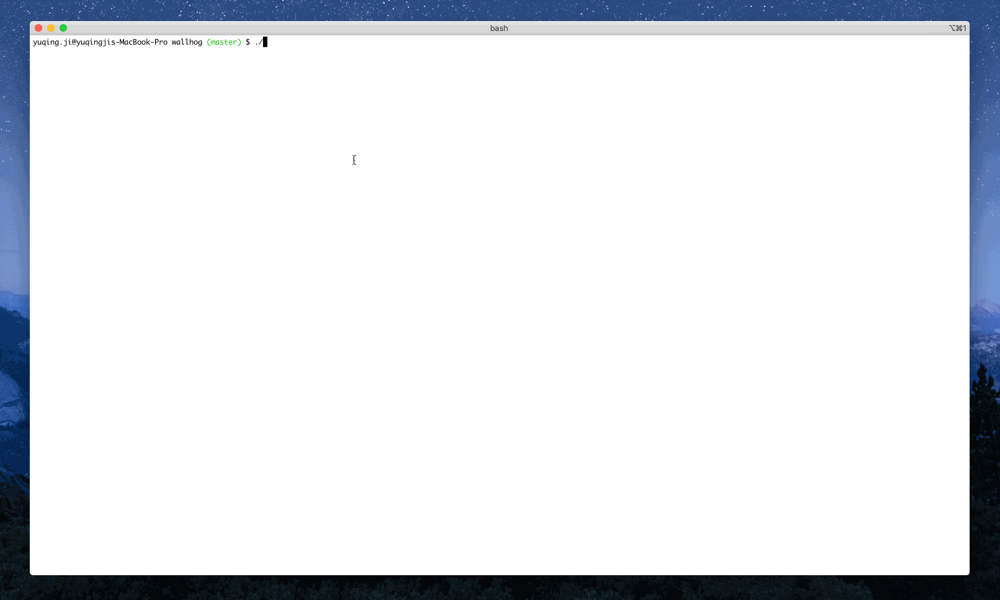

# wallhog



Web search from cmd. 

`$ ./wh <keyword>` will:
- open your default browser
- search <keyword> via the 'general' search engine(s) - search engine(s) tagged as 'general' in `./tunnels/tunnels.json`

If required specific search engine(s), you could `$ ./wh <keyword> -t <tag>`
- e.g. `$ ./wh <keyword> -t book` will search <keyword> via the search engine(s) tagged as 'book' in `./tunnels/tunnels.json`

## Setup

```
$ git clone https://github.com/vjyq/wallhog.git
$ cd wallhog
$ bash install.sh
```
Restart your terminal to activate the env setting. 

Then there should be a binary file called `wh` in your wallhog dir. 
- locate your wallhog dir with `$ env | grep WALLHOG_PATH`

With `wh`, you could start your web search from cmd.

## Author

yuqing.ji@outlook.com