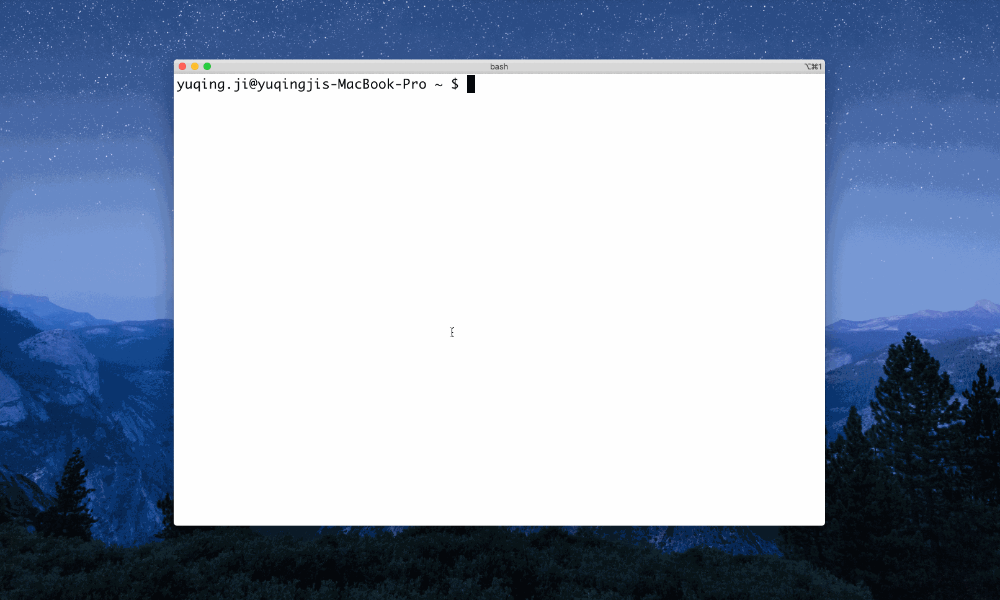

# wallhog



Web search from cmd. 

`$ wh <keyword>` will:
- open your default browser
- search <keyword> via the 'general' search engine(s) - search engine(s) tagged as 'general' in `./tunnels/tunnels.json`

If specific search engine(s) required, you could `$ wh -t <tag> <keyword>`
- e.g. `$ wh -t book <keyword>` will search <keyword> via the search engine(s) tagged as 'book' in `./tunnels/tunnels.json`
- if multiple tags, you could `$ wh -t "<tag1> <tag2> ... <tagN>" <keyword>`. wallhog would search with the engines with all the tags.

## Setup

```
$ go get github.com/vjyq/wallhog
$ cd $(go env GOPATH)/src/github.com/vjyq/wallhog/bin
$ bash shortcut.sh
```
Then just restart your terminal.

## Customize wallhog

By default wallhog loads the search engines in `./tunnels/tunnels.json`, you could customize it with your search preference. 

For an update, you need to do 2 things:
- update `./tunnels/tunnels.json`. Assume you want to add 'Google' with a tag 'general', open `./tunnels/tunnels.json` and include the following lines:
```
{
  "name": "Google",
  "url": "https://www.google.com/search?q=",
  "tags": ["general"]
},
```
- then rebuild the src code: 
```
$ cd $(go env GOPATH)/src/github.com/vjyq/wallhog
$ go install
```

Highly recommend you share your search engine(s) through a pull request. PR name please follow: 
- [new engine] \<engine-name>

e.g. '[new engine] Google'

You could also submit an issue if you require my help. Issue name please refer to PR name. 

## Author

yuqing.ji@outlook.com